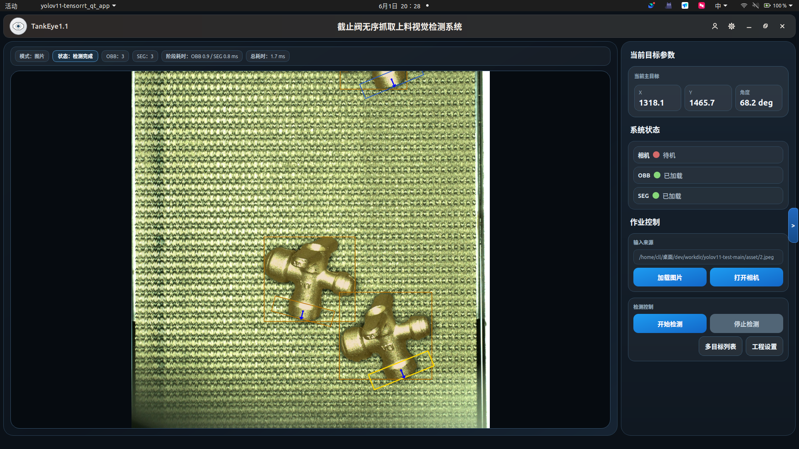

# YOLOv11 TensorRT

这是一个以部署层为核心、并额外带有 `Qt` 应用层的 YOLOv11 TensorRT C++ 项目。

当前包含两部分：

- 部署层：`DET / OBB / SEG`
- 应用层：`Qt` 联合界面，负责同时调用 `OBB + SEG`，并提供模拟机械臂自动抓取闭环

当前保留 4 个入口：

- `DET`：标准目标检测
- `OBB`：旋转框检测
- `SEG`：实例分割
- `APP`：Qt 联合应用层

当前开发环境已按 `CUDA 12.6 + TensorRT 10.6 + OpenCV 4.12 + Qt5` 路线整理。
如果本机通过 apt 安装 TensorRT，`trtexec` 通常位于：

```bash
/usr/src/tensorrt/bin/trtexec
```

## 界面演示



## 文档导航

- `README.md`
  项目总览与构建入口
- `README_APP.md`
  Qt 应用层说明、分层方式、构建和运行方法
- `README_OBB.md`
  `OBB` 部署与推理说明
- `README_SEG.md`
  `SEG` 部署与推理说明

## 当前可执行入口

### 1. DET

- 源文件：`main.cpp`
- 目标：`yolov11-tensorrt`

### 2. OBB

- 源文件：`main_obb.cpp`
- 目标：`yolov11-tensorrt_obb`

### 3. SEG

- 源文件：`main_seg.cpp`
- 目标：`yolov11-tensorrt_seg`

### 4. APP

- 源文件：`qt/main.cpp`
- 目标：`yolov11-tensorrt_qt_app`

## 项目结构

```text
yolov11-tensorrt/
├── asset/
├── build/
├── qt/
│   ├── grasp_main_window.*
│   ├── grasp_workflow.*
│   ├── robot_controller.*
│   ├── frame_postprocess.*
│   ├── frame_overlay.*
│   └── frame_result.h
├── src/
│   ├── YOLOv11.cpp
│   ├── YOLOv11.h
│   ├── YOLOv11_OBB.cpp
│   ├── YOLOv11_OBB.h
│   ├── YOLOv11_SEG.cpp
│   ├── YOLOv11_SEG.h
│   ├── deploy_utils.cpp
│   ├── deploy_utils.h
│   ├── trt_utils.cpp
│   ├── trt_utils.h
│   ├── preprocess.cu
│   ├── preprocess.h
│   ├── cuda_utils.h
│   ├── runtime_utils.h
│   ├── logging.h
│   ├── macros.h
│   ├── model_utils.h
│   └── common.h
├── main.cpp
├── main_obb.cpp
├── main_seg.cpp
├── CMakeLists.txt
├── README.md
├── README_APP.md
├── README_OBB.md
└── README_SEG.md
```

## 基本构建

Linux 下建议使用系统 Qt5，不建议混用 Anaconda Qt：

```bash
sudo apt update
sudo apt install qtbase5-dev qtbase5-dev-tools qt5-qmake
```

如果之前 build 目录缓存过 Anaconda Qt，先清理：

```bash
rm -rf build
```

```bash
cmake -S . -B build
cmake --build build --config Release
```

如果只想单独编译某个目标：

```bash
cmake --build build --target yolov11-tensorrt --config Release
cmake --build build --target yolov11-tensorrt_obb --config Release
cmake --build build --target yolov11-tensorrt_seg --config Release
cmake --build build --target yolov11-tensorrt_qt_app --config Release
```

## Engine 生成

从 Ultralytics 导出的 ONNX 生成 TensorRT engine：

```bash
/usr/src/tensorrt/bin/trtexec \
  --onnx=./weights/best_obb.onnx \
  --saveEngine=./weights/best_obb.engine \
  --fp16

/usr/src/tensorrt/bin/trtexec \
  --onnx=./weights/best_seg.onnx \
  --saveEngine=./weights/best_seg.engine \
  --fp16
```

## 快速开始

### 1. DET

```bash
./build/yolov11-tensorrt ./weights/yolo11s_trt.engine ./asset/bus.jpg
```

### 2. OBB

```bash
./build/yolov11-tensorrt_obb ./weights/best_obb.engine ./asset/20260331_090339_757.jpg
```

### 3. SEG

```bash
./build/yolov11-tensorrt_seg ./weights/best_seg.engine ./asset/20260331_090339_757.jpg
```

### 4. APP

```bash
./build/yolov11-tensorrt_qt_app ./weights/best_obb.engine ./weights/best_seg.engine
```

如果启动时传了两个模型路径，程序会在首次显示时自动尝试加载。
如果不在启动参数里传模型，也可以先打开程序，再在界面里的 `工程设置` 手动加载两个 engine。

Qt 应用中 `开始检测` 执行单帧联合检测；`自动抓取` 会进入模拟闭环：

```text
检测当前帧 -> 选出 primary_index 主目标 -> 模拟机械臂执行 -> 回原点回调 -> 重新检测
```

当前机械臂控制为模拟版，回调由 `qt/robot_controller.*` 中的 `QTimer` 触发。
真实机械臂接入时，替换该控制器内部实现即可。

## 说明

- `APP` 的应用层说明看 `README_APP.md`
- `DET` 的基础入口看 `README.md`
- `OBB` 的部署细节看 `README_OBB.md`
- `SEG` 的部署细节看 `README_SEG.md`
